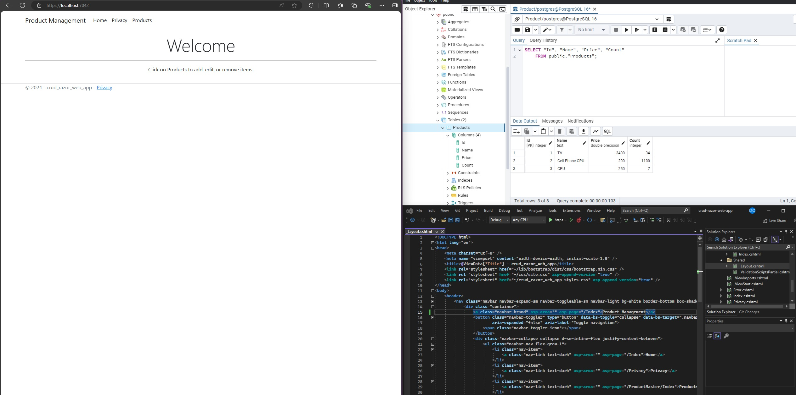
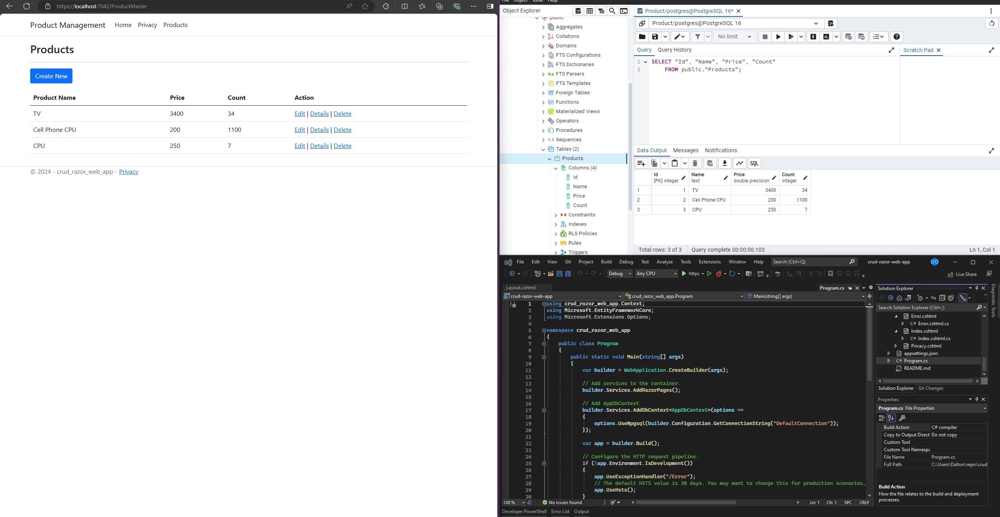
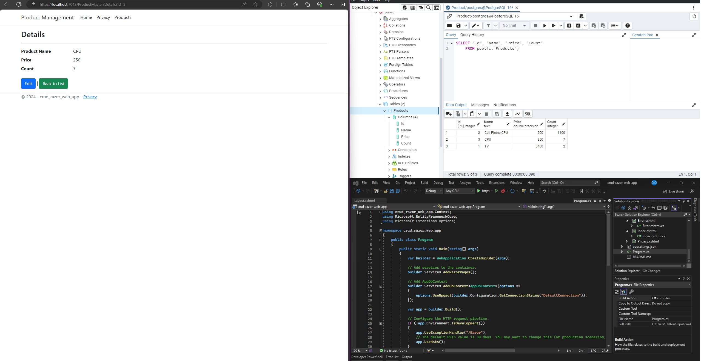
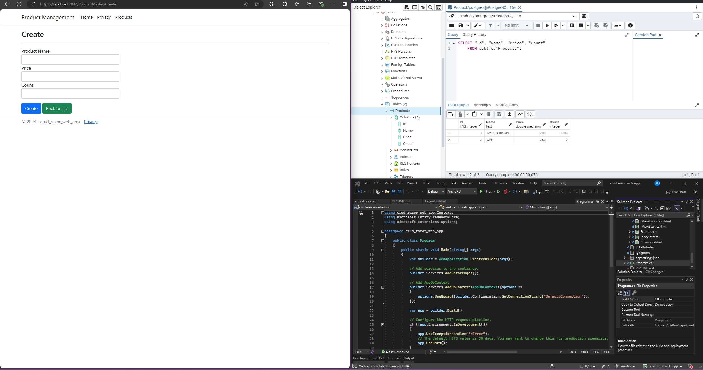
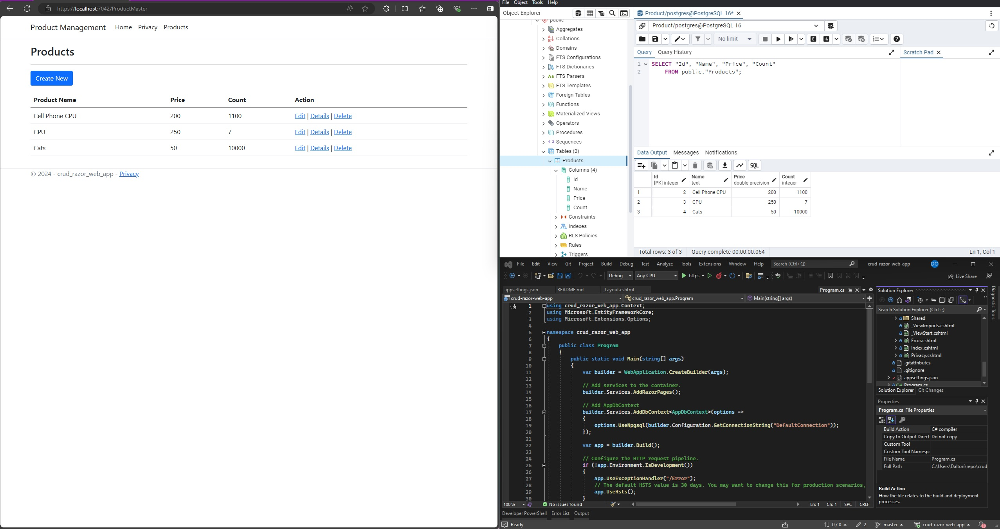
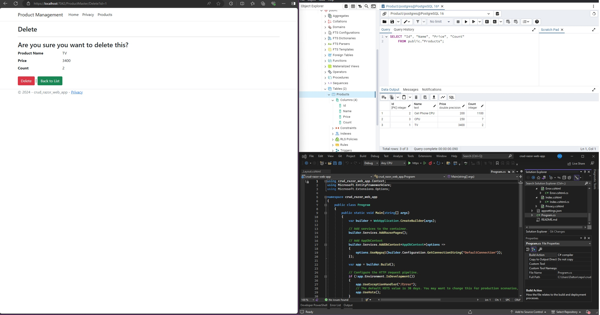
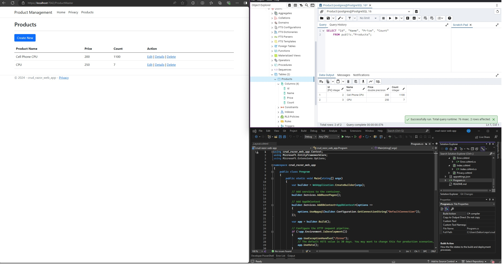
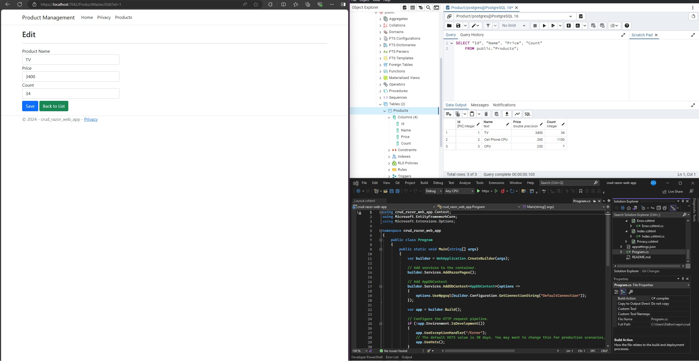
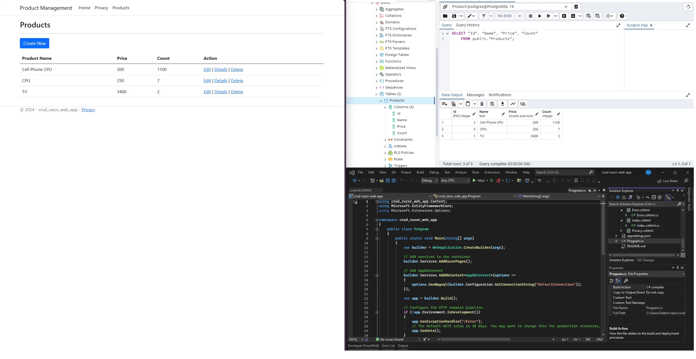

# CRUD-web-app

This is a very simple CRUD web application built with Razor with no authentication used. 
I've connected a PostgreSQL db for demonstration purposes. With this in mind, please see below for screenshots of functionality.

---

Product page:

---

Details of a product:

---

Create a new entry:

After creation:

---

Delete page and functionality:

After delete

---

Edit:

After the edit:

---

